# BeerLine Buddy

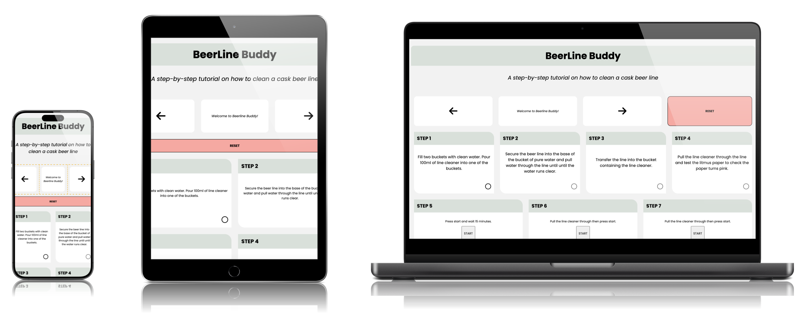

BeerLine Buddy is a web page containing a step by step guide instructing users how to complete a successful line clean for a cask beer line.

The client requires a web page that contains clear and concise instructional information that makes the process of cleaning a beer line simple and easy to follow.

The objectives of this site are to provide the client with functional and dynamic instructional content to informs staff how to clean a cask beer line.

# UX

## Goals

### Visitor Goals

The target audience for BeerLine Buddy includes:

- Existing members of staff who want a tool to make cleaning a beer line easier.
- New members of staff with little knowledge of cleaning a beer line.

The user goals include:

- To be guided through the steps of cleaning a beer line from start to finish.
- The learn how to clean a beer line with no prior knowledge.
- The use the page as a reminder of where in the process of cleaning a beer line they have got to.

The design achieves these needs by:

- Having a simple page and color-theme design making information clear and easy to read.
- Having limited and concise text content to assist in keeping the attention of users.
- Providing an interactive set of informative slides which can be navigated through to instruct the user how to use the step-by-step guide.
- Incorporating multiple sequential functions which guide the user through the various steps of the process.
- Having interactive checkboxes which not only act as part of the sequential path the user follows but also as a prompt reminding the user where they got to during a particular line clean.

### Business Goals

The business goals include:

- To ensure all staff (old and new) are able to fully clean a beer line and use the app when required to act as a prompt and informative guide.
- To increase the sale of beer by minimising the time spent cleaning the lines.
- To have a web page that is easy to access and is fully responsive on desktops, tablets and mobile devices as all are utilised in this workplace.

### User Stories

1. As a user who is a new member of staff, I want to be able to easily understand the process of cleaning a beer line.

2. As a user who only works part time, I need to be able to understand the process without any prior knowledge of cleaning a beer line.

3. As an existing member of staff on a busy shift, I expect to be able to use the web page as a useful tool to remind myself which stage I got to during a line clean.

4. As a trainer for new members of staff, I need to be able to easily access the web page and use it as a development tool for new recruits. 

7. As a staff member with reading difficulties, I expect the website to be compatible with a screen reader.

## Visual Design

### Wireframes

Wireframes were drawn on [balsamic](https://balsamiq.com) to draw a general layout of the proposed web page.

Click here to view wireframes: https://drive.google.com/file/d/1bzuUj2UIKF1NtDKklYr7TjZ9UcAVwtdT/view?usp=sharing

### Fonts

Fonts were imported into the code from [Google Fonts](https://fonts.google.com/).

- The logo utilised the 'Poppins' Google font.
As a Google Font, Poppins is optimized for web use, ensuring fast loading times and high-quality rendering. Poppins modern and professional appearance makes it an excellent choice this tutorial, where readability is crucial.

- The 'Open Sans' Google font is utilised for all other text content on the page. Open Sans is widely used for its clarity and readability, making it a perfect choice for this informative web page.

### Icons

- Icons from the 'Fontawesome' Icon library have been utilised for the step and timer step checkboxes as well as the previous and next icons in the info-div. 
- The icons have been styled cohesively with the overarching color palette.

### Colors

With the user and business goals in mind, it is important for this site to have a minimalist color palette. The color palette needs to appear professional and needs to constrast where appropriate to make the content clear and easy-to-read.

- 'White smoke' #F5F5F5, 'White' #FFFFFF, 'Platinum' #D8E0DA
The combination of platinum, white smoke, and white forms a sophisticated and stylish color scheme. Their subtle contrasts and modern appeal provide a clean, elegant appearance while ensuring visual clarity and harmony. The combination of whitesmoke and platinum evokes the imagery of beer kegs and casks in a cellar, aligning perfectly with the website's theme.

- 'Emerald' #50C878
Emerald is a rich, vibrant shade of green that stands out well against most backgrounds, making the checked state of the checkbox easily noticeable.

- 'Melon' #F5A9A1
Melon contrasts well with the softer colors of platinum, whitesmoke, and white, adding a touch of vibrancy while keeping a professional look. This makes the reset button both noticeable and easy to use.

### Images

This webpage intentionally excludes images to maintain a focus on providing clear and straightforward information. The design prioritizes simplicity and functionality. However, instructional images/diagrams may be added in the future to visually enhance each step and improve understanding.

### FEATURES

#### Page Elements

##### Logo / Header

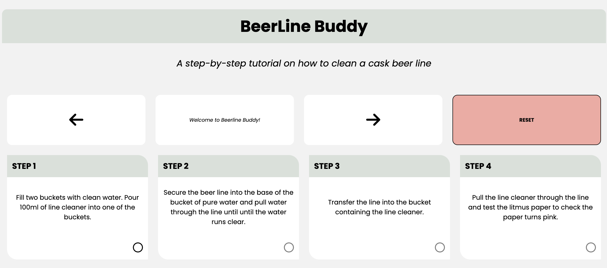

A simple, bold header along-side an informative tag line both in the Poppins font enhances the page design by providing clear, immediate emphasis and readability. 

##### Information Slides

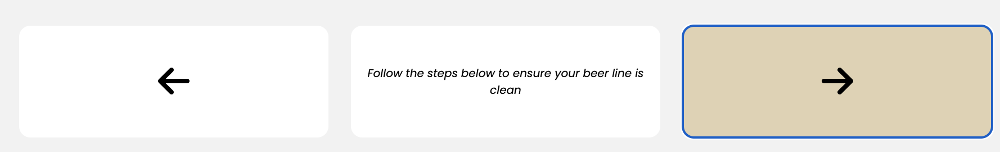

The information slides are displayed to provide the user with instructions on how to use the web page and the step/checkbox format. 
The slides are managed by a JavaScript array which holds each slides content, each slide is indexed sequentially.
The arrow buttons (previous and next) adjust the current slide index, enabling the display to change text as the code iterates through the array.
Using the array to track slide numbers makes navigation between slides smooth and easy for the user.

#### Reset Button

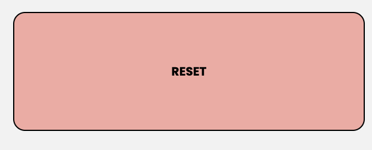

The reset button stands out due to its distinct color, making it easily recognizable on the page. When clicked (with the use of a 'click' event listener), it refreshes the webpage, clearing all current entries and resetting the content. Additionally, the page scrolls back to the top, giving the appearance of a fresh start.

This button is designed to simplify the process of resetting the page, it is especially useful for starting a new beer line cleaning process or quickly correcting any mistakes. It provides users with a straightforward way to restart and ensure everything is set up correctly.

Since users generally read from left to right, I placed the reset button to the right of the info-div on larger screens. I wanted the info-div to be more prominent than the reset button when users first visit the desktop version of the webpage so I placed the info-div on the left.

#### Step Dividers

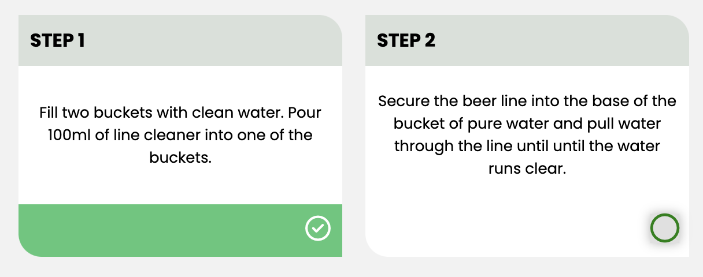

Each step divider contains a checkbox which can be marked as selected, and upon clicking the checkbox it then enables the next checkbox to be clickable, thus giving the steps of the tutorial a sequential flow which allows the user to easily understand the order in which the tasks are required to be carried out. 

A function named checkboxClick has been created which handles the checkbox clicks. When a checkbox is clicked, it checks the checkbox, marks it as selected, and activates the next checkbox on the list. 

The click listeners associated with the checkboxes ensure that when the function is called the code handles the check/uncheck logic and the stylings of the checkbox animate and the checkbox becomes visually 'checked'. 

When the last checkbox is reached and checked, a hidden div is shown and the page scrolls to the bottom ensuring that the user now knows the line is clean.

#### Timer dividers

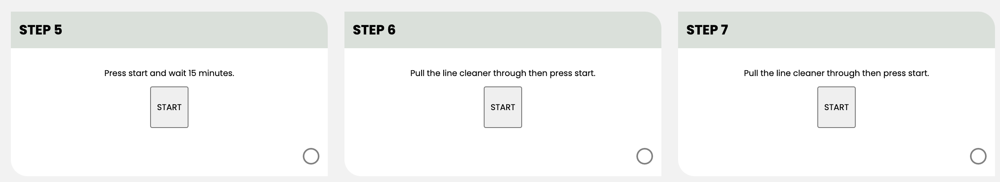

The timer dividers are integrated as part of the sequential flow of the step dividers. The timer dividers each contain a 15 minute countdown timer which allows for the line cleaner to settle within the beer line and thus assists in the cleaning of the line. 

The timers have been programmed to start by adding click event listeners to their associated start buttons. The timers count down from a set time, updating the display each second using an interval function and countdown logic.

Manipulation of the (900) seconds was required to ensure the minutes and seconds are displayed correctly and recognisably on the web page during the countdown timer. The minutes and seconds were converted into strings and the strings were programmed (using the padStart method) so that a '0' will appear before any single digit numbers to make the timer appear more clean and professional.

#### Hidden Divider

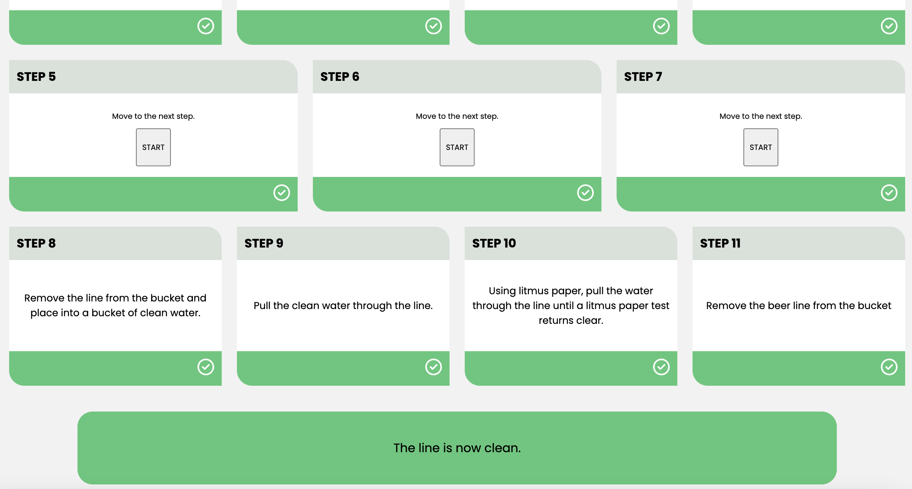

The hidden div is initially set to be invisible. It only appears once all the checkboxes have been checked, indicating that every step of the process has been completed. Additionally, the page automatically scrolls to the bottom to ensure the user sees the newly visible div. This div then displays a message informing the user that they have successfully completed the line cleaning process.

#### Footer

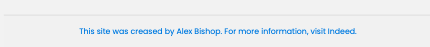

The footer at the bottom of the page credits myself as the creator of the site. It also includes a link to Indeed which opens in a new tab, providing users with more information or resources related to the site.

## Feature Ideas

- The addition of instructional diagrams into each step to provide an even clearer tutorial.
- The ability for the user to type and input and set a beer line 'name' into the web page so that the user knows which line they are using.
- A log-in feature where the only people who have access to the site are those provided with log in details (staff).

## Technologies Used

### Languages
- Html - Used for page markup
- CSS - Used for styling
- JavaScript - Used for interactivity and DOM manipulation

### Libraries
- Google Fonts - Used for font style 'Poppins' and 'Open Sans'.
- Font Awesome - Used for retreiving the 'next' and 'previous' button arrows and the checkbox icons.

### Platforms
- Gitpod - IDE for project developemnt.
- Github - Used for storing code removely and for deployment.

### Other Tools Utilised
- Coolers - For color selection and color swatch.
- SMPRO - App utilised for framing web page screengrabs with iphone/ipad/macbook.

### TESTING

#### METHODS

##### Validation Process
- The HTML and CSS files have been validated with W3C HTML/CSS Validator, with no errors or warnings to show for the CSS, however two warnings were raised for the html - These issues remain but are not deemed significant.
- The site has been tested against the google devtools lighthouse service to ensure accessibility is at 100%.
- The JavaScript code has been tested on the JHint service with no errors raised.
- The web page has been manually tested for screen reader compatibility using the Google Chrome screen reader extension with no aparent defects noted. 

##### GENERAL TESTING

- Each time a feature was added a preview port was opened to test the website to view the impact of the changes and to note any immediate bugs.
- Adaptations were made to the stylings on the google dev tools service whilst previewing the web page to manipulate and experiment with stylings outside of the gitpod IDE.
- The web bage was sent to friends and family for testing, with feedback being documented and acted upon.
- The form within the web page has been fully validated and will not send without the propper validation (all inputs containing the required information).
- All external links have been tested and each open in a new tab.

Below are the results from the CSS, html and accessibility checks.

CSS VALIDATOR RESULT:

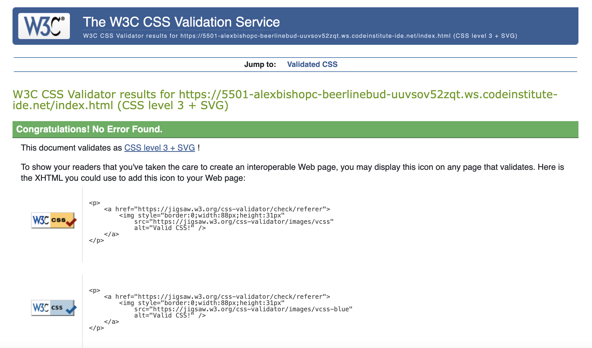

HTML VALIDATOR RESULT:

> Two minor warnings exist.

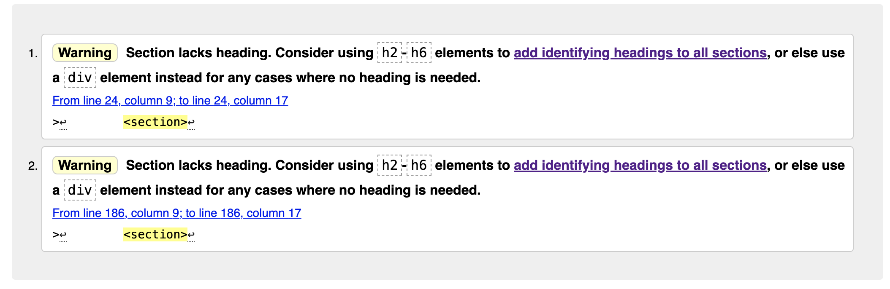

JAVASCRIPT VALIDATOR RESULT:

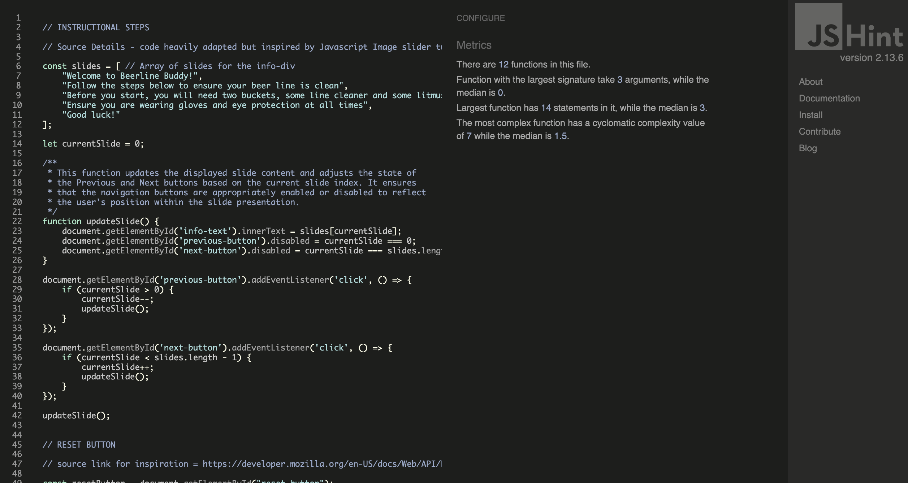

PERFORMANCE AND ACCESSIBILITY VALIDATOR RESULT:

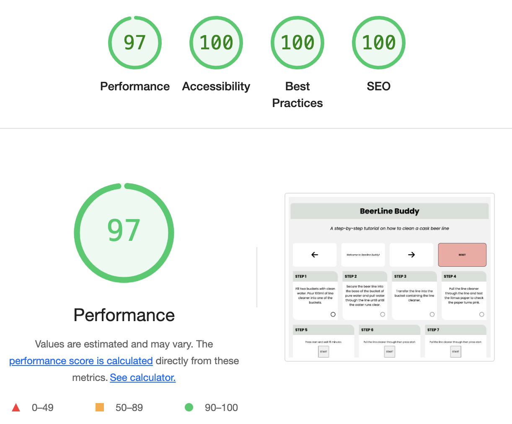

##### MOBILE TESTING
- The site was frequently tested on my personal iphone with iOS as well as sent to friends/family with samsungs and older models of iphones to ask for feedback.
- Testing involved going through the entire sequential step checkbox process, utilising the previous and next buttons to navigate the instructional slides, utilising the reset button and activating all timers. 
- Chrome was utilised to inspect the site in mobile and tablet format, navigating the pages and testing the functions within Chromes 'development tools' service.

##### Desktop Testing
- The site has been developed within Chrome on a Macbook Pro.
- The site was sent to friends and family with instructions to open the page on their desktops.
- The site has been tested on multiple browsers including Safari.

#### BUGS

##### Existing Bugs
- The countdown timers do not properly synchronize with their associated checkboxes. The checkboxes should only be clickable once the timers have finished.
 > As a result of the above, the decision was made to adjust the checkbox array to include checkboxes five, six and seven so that the sequential nature of the checkboxes made sense. The timers for now do not make their associated checkboxes clickable upon completion of the timer.

##### Fixed Bugs
- Timer bug #1 - Initially, I used setInterval to manage the countdown timers, but I observed that the displayed time occasionally advanced by several seconds. This discrepancy was due to the cumulative delay associated with setInterval. After researching the issue, I discovered that using setTimeout instead provided a more accurate countdown. setTimeout ensures that the next execution of the function only begins once the previous execution is fully complete, resulting in a more reliable and glitch-free countdown.

- Timer bug #2 - The timers behave erratically when clicked multiple times, which is caused by overlapping timer functions. To fix this, I implemented a system to track active timers. This system maintains a list of running timers and checks if a timer is already active before starting a new one. Once a timer finishes, it is removed from the list, allowing a new timer to be started if needed.

- The user was previously able to uncheck the checkboxes after they had checked them, logic was then added to the event listener after it has been checked so that users cannot interact with that checkbox it again.

- Accessibility performance initially failed in testing due to a lack of aria-labels on the reset, next, previous and start buttons. Aria labels were added to all buttons and the accessibility check provided a successful score of 100.

- Accessibility performance failed once more as the color of the footer text didnt provide enough contrast against the background for readability. The font color was then changed to black to ensure its readabilily was sufficient.

##### DEPLOYMENT

This site has been deployed to GitHub pages via the following steps:

- Within the GitHub BeerLine-Buddy repository, the settings tab was opened.
- Within the settings tab, the 'pages' menu option in the left hand column was opened.
- Within 'pages', the settings for the branch were changed to ensure this was set to the 'main' branch. After this the 'Save' button was clicked.

The live link to the site can be accessed here: https://alexbishopcode.github.io/BeerLine-Buddy/

#### CREDITS AND CONTACT

##### Content

All text content on the web page was written by myself from scratch from my prior knowledge of the topic.

The javascript educational content from Mosh's "Ultimate JavaScript Part 1: Fundamentals" was extensively utilised throughout this project. Whilst any uncited JavaScript code used in this project is original, Mosh's course served as a significant source of inspiration and provided valuable insights into various topics. For more information, you can visit [Mosh's course. ](https://members.codewithmosh.com/)

The Javascript code utilised for the informative slide section was inspired by JavaScript code within the Image slider tutorial by @smartcode9021 on YouTube.

The reload click event listener was taken from the following link https://developer.mozilla.org/en-US/docs/Web/API/Location/reload. The basic code was taken from this example but adapted and built upon for my specific needs.

AI powered generator 'ChatGPT' was utilised whilst creating the timer - specifically whilst
converting the mintues and seconds into strings and for utilising the padStart method as this was a totally new concept to me and one which I found difficult to source via online tutorials. The code suggestion provided by the AI answer was adapted to suit my own specific needs and to ensure it was not a direct replica of the provided suggestion - https://chatgpt.com/

The following page on https://css-tricks.com was used to assist with transition CSS Stylings - https://css-tricks.com/almanac/properties/t/transition/

The Sample Project README.md section of the Full Stack Web Development course on [Code Institute](https://www.codeinstitute.net) was used as a guide to understand the content required to be present within a README.md file.

The 'Horizon Photography'(https://github.com/Ri-Dearg/horizon-photo/blob/main/README.mdREADME) project owned by Ri-Dearg on github was used as a guide to create a general framework for this README.md file.

##### Contact

Please feel free to contact me on helloalexbishop@gmail.com
