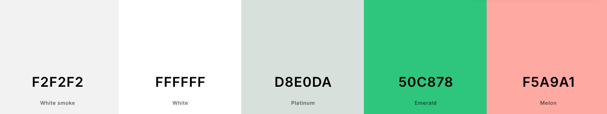

# BeerLine Buddy

ADD FRAMES 

BeerLine Buddy is a web page containing a step by step guide instructing users how to complete a successful line clean for a cask beer line.

The client requires a web page that contains clear and concise instructional information that makes the process of cleaning a beer line simple and easy to follow.

The objectives of this site are to provide the client with functional and dynamic instructional content to informs staff how to clean a cask beer line.

# UX

## Goals

### Visitor Goals

The target audience for 60 Minute Soho includes:

- Existing members of staff who want a tool to make cleaning a beer line easier.
- New members of staff with little knowledge of cleaning a beer line.

The user goals include:

- To be guided through the steps of cleaning a beer line from start to finish.
- The learn how to clean a beer line with no prior knowledge.
- The use the page as a reminder of where in the process of cleaning a beer line they have got to.

The design achieves these needs by:

- Having a simple page and color-theme design making information clear and easy to read.
- Having limited and concise text content to assist in keeping the attention of users.
- Incorporating multiple sequential functions which guide the user through the various steps of the process.
- Providing an interactive set of informative slides which can be navigated through to instruct the user how to use the step-by-step guide.
- Having interactive checkboxes which not only act as part of the sequential path the user follows but also as a prompt reminding the user where they got to during a particular line clean.

### Business Goals

The business goals include:

- To ensure all staff (old and new) are able to fully clean a beer line and use the app when required to act as a prompt and informative guide.
- To increase the sale of beer by minimising the time spent cleaning the lines.
- To have a web page that is easy to access and is fully responsive to both tablets and mobile devices as both are utilised in this workplace.

### User Stories

1. As a user who is a new member of staff, I want to be able to easily understand the process of cleaning a beer line.

2. As a user who only works part time, I need to be able to understand the process without any prior knowledge of cleaning a beer line.

3. As an existing member of staff on a busy shift, I expect to be able to use the web page as a useful tool to remind myself which stage I got to during a line clean.

4. As a trainer for new members of staff, I need to be able to easily access the web page and use it as a development tool for new recruits. 

7. As a staff member with reading difficulties, I expect the website to be compatible with a screen reader.

## Visual Design

### Wireframes

Wireframes were drawn on [balsamic](https://balsamiq.com) to draw a general layout of the proposed web page.

Click here to view wireframes: https://drive.google.com/drive/folders/1sStum-9PVeh2ybLao4RfvSAAKJ0clWOX?usp=sharing

### Fonts

Fonts were imported into the code from [Google Fonts](https://fonts.google.com/).

- All font on the page uses the 'Poppins' Google font.
As a Google Font, Poppins is optimized for web use, ensuring fast loading times and high-quality rendering on all devices. Poppins modern and professional appearance makes it an excellent choice for tutorials, where readability is crucial.

### Icons

- Icons from the 'Fontawesome' Icon library have been utilised for the step and timer step checkboxes as well as the previous and next icons in the info-div. 
- The icons have been styled cohesively with the overarching color palette.

### Colors

With the user and business goals in mind, it is important for this site to have a minimalist color palette. The color palette needs to appear professional and needs to constrast where appropriate to make the content clear and easy-to-read.

- 'White smoke' #F5F5F5, 'White' #FFFFFF, 'Platinum' #D8E0DA
The combination of platinum, white smoke, and white forms a sophisticated and stylish color scheme. Their subtle contrasts and modern appeal provide a clean, elegant appearance while ensuring visual clarity and harmony. The combination of whitesmoke and platinum evokes the imagery of beer kegs and casks in a cellar, aligning perfectly with the website's theme.

- 'Emerald' #50C878
Emerald is a rich, vibrant shade of green that stands out well against most backgrounds, making the checked state of the checkbox easily noticeable.

- 'Melon' #F5A9A1
Melon contrasts well with the softer colors of platinum, whitesmoke, and white, adding a touch of vibrancy while keeping a professional look. This makes the reset button both noticeable and easy to use.

### Images

This webpage intentionally excludes images to maintain a focus on providing clear and straightforward information. The design prioritizes simplicity and functionality. However, instructional images may be added in the future to visually enhance each step and improve understanding.

### FEATURES

#### Page Elements

##### Logo / Header

A simple, bold header along side an informative tag loine both in the Poppins font enhances the page design by providing clear, immediate emphasis and readability. 

##### Information Slides

The information slides are displayed to provide the user with instructions on how to use the web page and the step/checkbox format. 
The slides are managed by a JavaScript array which holds each slides content, each slide is indexed sequentially.
The arrow buttons (previous and next) adjust the current slide index, enabling the display to change text as the code iterates through the array.
Using the array to track slide numbers makes navigating between slides smooth and easy.

#### Reset Button

The reset button stands out due to its distinct color, making it easily recognizable on the page. When clicked (with the use of a 'click' event listener), it refreshes the webpage, clearing all current entries and resetting the content. Additionally, the page scrolls back to the top, giving the appearance of a fresh start.

This button is designed to simplify the process of resetting the page, it is especially useful for starting a new beer line cleaning process or quickly correcting any mistakes. It provides users with a straightforward way to restart and ensure everything is set up correctly.

Since users generally read from left to right, I placed the reset button to the right of the info-div on larger screens. I wanted the info-div to be more noticeable when users first visit the desktop version of the webpage.

 

#### Step Dividers

The tours section includes information regarding the three tours that are currently available to the user.

Three sections of informative text have been presented on top of three separate images. Each image is related to its respective text.

Images have been used here to communicate the purpose of each tour and to help the user distinguish between the tours, giving a sense of variety.

Each of the three tours have been styled into a flexbox grid. The flex value allows for a media query to be utilised and to position the content side by side in three columns on larger screens and stacked on top of one another on smaller screens.

The width of the images within the content are all fully resonsive to adjustments in screen size.

#### Timer dividers

The accessibility information section includes four divs within a flexbox grid. Each div contains clear information and icons to provide users wishing to learn more about the accessibility of the tours with more information. 

The flexbox grid allows the information to be responsive to changes in screen size and the content changes column formation via a screen size media query.

#### Hidden Divider

The sign up section is created using a form element. The form is designed to be simple and easy to use.

Positioning the form at the bottom of the site ensures the user flow is not interrupted. When the user flow is interrupted it can encourage user abandoment. 

The simple design is purposeful to ensure that the process of completing the form appears easy and streamlined.

An option for the user to sign up for a newsletter has been added using radiobuttons at the bottom of the form to allow them to give permission for further information and promotional material to be sent to their email.

## Feature Ideas

- A interactive gallery/slide section with photos of content and people taking part in the walking tours.
- Purchasing/cart options.
- An interactive section displaying text from review websites.
- A FAQ section to answer more of the users questions.
- More options on the form to allow the user register and also log into the website if they have already registered.

## Technologies Used

### Languages
- Html - Used for page markup
- CSS - Used for styling
- Javascript - Used for DOM manipulation

### Libraries
- Google Fonts - Used for font style ('Poppins').
- Font Awesome - Used for retreiving the 'next' and 'previous' button arrows and the checkbox icons.

### Platforms
- Gitpod - IDE for project developemnt.
- Github - Used for storing code removely and for deployment.

### Other Tools Utilised
- Coolers - For color selection and color swatch.
- SMPRO - App utilised for framing web page screengrabs with iphone/ipad/macbook.
- 

### TESTING

#### METHODS

##### Validation Process
- The HTML and CSS files have been validated with W3C HTML/CSS Validator, with no errors or warnings to show.
- The site has been tested against the google devtools lighthouse service to ensure accessibility is at 100%.
<!-- - The web page has been manually tested for screen reader compatibility using the Google Chrome screen reader extension with no aparent defects noted. -->

##### GENERAL TESTING

- Each time a feature was added a preview port was opened to test the website to view the impact of the changes and to note any immediate bugs.
- Adaptations were made to the stylings on the google dev tools service whilst previewing the web page to manipulate and experiment with stylings outside of the gitpod IDE.
- The web bage was sent to friends and family for testing, with feedback being documented and acted upon.
- The form within the web page has been fully validated and will not send without the propper validation (all inputs containing the required information).
- All external links have been tested and each open in a new tab.

Below are the results from the CSS, html and accessibility checks.

##### MOBILE TESTING
- The site was frequently tested on my personal iphone with iOS as well as sent to friends/family with samsungs and older models of iphones to ask for feedback.
- Testing involved going through the entire sign up process, utilising the navigation bar, and checking all website functions.
- Chrome was utilised to inspect the site in mobile and tablet format, navigating the pages and testing the functions within Chromes 'development tools' service.

##### Desktop Testing
- The site has been developed within Chrome on a Macbook Pro.
- The site was sent to friends and family with instructions to open the page on their desktops.
- The site has been tested on multiple browsers including Safari.

#### BUGS

##### Existing Bugs
- The countdown timers do not properly synchronize with their associated checkboxes. The checkboxes should only be clickable once the timers have finished.
 As a result of the above, the decision was made to adjust the checkbox array to include checkboxes five, six and seven so that the sequential nature of the checkboxes made sense. 

##### Fixed Bugs
- Timer bug #1 - Initially, I used setInterval to manage the countdown timers, but I observed that the displayed time occasionally advanced by several seconds. This discrepancy was due to the cumulative delay associated with setInterval. After researching the issue, I discovered that using setTimeout instead provided a more accurate countdown. setTimeout ensures that the next execution of the function only begins once the previous execution is fully complete, resulting in a more reliable and glitch-free countdown.

- Timer bug #2
- Timer bug #3
- The fixed (sticky) navigation bar at the top of the page was covering sections of text when utilised so the associated sections of the site you were expecting to navigate to appeared muddled and unclear. This was fixed by adding a hidden div above each section the same height of the nav bar and linking each nav bar menu option to the appropriate hidden divs in order for the user to see the full content of the section they choose to view.

- The booking form loaded an error message once details had been entered saying the page visited was not secure. This was due to a typo in the target="" where https:// was written as http://.

- Accessibility performance initially failed in testing due to a lack of aria-labels on the reset, next, previous and start buttons. Aria labels were added to all buttons and the accessibility check provided a successful score of 100.

##### DEPLOYMENT

This site has been deployed to GitHub pages via the following steps:

- Within the GitHub BeerLine-Buddy repository, the settings tab was opened.
- Within the settings tab, the 'pages' menu option in the left hand column was opened.
- Within 'pages', the settings for the branch were changed to ensure this was set to the 'main' branch. After this the 'Save' button was clicked.

The live link to the site can be accessed [here](https://alexbishopcode.github.io/60-Minute-Soho/)

https://alexbishopcode.github.io/60-Minute-Soho/

#### CREDITS AND CONTACT

##### Content

All text on the web page was written by myself from scratch with prior knowledge of the topic.

The Love Maths Project on the [Code Institute](https://www.codeinstitute.net) Full Stack Web Development Course was used as a loose template to create some of the general framework of the site. 
Most notably the code from the Love Running project was utilised to create the foundation of the navigation bar, the sign up form and the social media links before developing and adapting these to be coherant with my web page design and distinguished functions for this project.

The Sample Project README.md section of the Full Stack Web Development course on [Code Institute](https://www.codeinstitute.net) was used as a guide to understand the content required to be present within a README.md file.

The 'Horizon Photography'(https://github.com/Ri-Dearg/horizon-photo/blob/main/README.mdREADME) project owned by Ri-Dearg on github was used as a guide to create a general framework for this README.md file.

##### Contact

Please feel free to contact me on helloalexbishop@gmail.com

